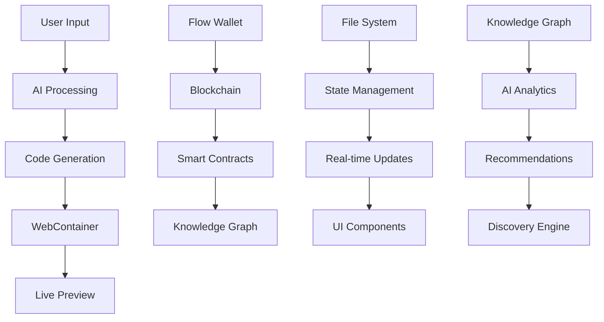

# Cosmiq - Advanced AI-Powered Web3 Development Platform


https://github.com/user-attachments/assets/061394b7-9399-4c7f-a54c-9cffc73949e2

**A next-generation AI-powered development platform that generates full-stack Web3 applications with integrated smart contracts from natural language prompts, running entirely in your browser with integrated Flow blockchain functionality and advanced knowledge graph intelligence.**

## 🚀 **Overview**

Cosmiq represents the future of Web3 development - a sophisticated platform that combines cutting-edge AI technology with blockchain infrastructure to create a seamless development experience. Built on a foundation of modern web technologies, Cosmiq enables developers to build, deploy, and manage sophisticated Web3 applications integrated with smart contracts without leaving their browser.

### **Key Innovation Areas**

- **🧠 AI-First Development**: Natural language to production-ready web3 apps with integrated smart contracts
- **⚡ Browser-Native Runtime**: Full Node.js environment in WebContainer
- **🔗 Blockchain Integration**: Native Flow blockchain support with smart contract deployment
- **📊 Knowledge Graph Intelligence**: Advanced dApp analytics and discovery
- **🔄 Real-time Collaboration**: Streaming AI responses with live development environment

---

## 🏗️ **Technical Architecture**

### **Core Technology Stack**

<details>
<summary><strong>Frontend Framework & UI</strong></summary>

- **Remix** - Full-stack React framework with server-side rendering
- **React 18** - Modern React features with concurrent rendering
- **TypeScript** - Type-safe development with advanced type inference
- **Tailwind CSS** - Utility-first styling with custom design system
- **UnoCSS** - Atomic CSS engine for optimized bundle size
- **Framer Motion** - Advanced animations and gesture handling
- **Radix UI** - Accessible, unstyled component primitives

</details>

<details>
<summary><strong>AI & Machine Learning</strong></summary>

- **Vercel AI SDK** - Streaming AI responses with tool calling
- **Anthropic Claude** - Primary AI provider with advanced reasoning
- **Multi-Provider Support** - OpenAI, Google, Cohere, Mistral, DeepSeek
- **Streaming Intelligence** - Real-time response generation
- **Context Optimization** - Smart prompt engineering and context management
- **Prompt Enhancement** - Automatic prompt improvement and validation

</details>

<details>
<summary><strong>Blockchain & Web3</strong></summary>

- **Flow Blockchain** - Developer-friendly blockchain with resource-oriented programming
- **Flow Client Library (FCL)** - Secure wallet integration and transaction management
- **Cadence** - Resource-oriented smart contract language
- **Multi-Wallet Support** - Blocto, Lilico, Dapper wallet integration
- **Flow Testnet** - Integrated testing environment
- **Smart Contract Deployment** - Automated contract deployment and verification

</details>

<details>
<summary><strong>Development Environment</strong></summary>

- **WebContainer API** - Browser-based Node.js runtime
- **CodeMirror 6** - Advanced code editor with syntax highlighting
- **Xterm.js** - Full-featured terminal emulator
- **Vite** - Lightning-fast build tool and development server
- **File System API** - Native browser file operations
- **Hot Module Replacement** - Instant code updates

</details>

<details>
<summary><strong>Knowledge Graph & Intelligence</strong></summary>

- **Hypergraph Framework** - Decentralized knowledge graph infrastructure
- **GRC-20 Standard** - Composable knowledge graph tokens
- **IPFS Integration** - Decentralized content storage
- **AI-Powered Analytics** - Intelligent dApp discovery and recommendations
- **Composition Intelligence** - Cross-project opportunity identification

</details>

<details>
<summary><strong>State Management & Storage</strong></summary>

- **Nanostores** - Minimal state management library
- **Zustand** - Lightweight state management for complex scenarios
- **IndexedDB** - Browser-based persistent storage
- **File System Persistence** - Native file system integration
- **Cookie Management** - Secure credential storage
- **WebContainer State** - Synchronized development environment state

</details>

</details>


---

## 📊 **System Architecture**

### **Application Structure**

```
cosmiq/
├── 🎯 Core Application
│   ├── app/
│   │   ├── components/           # React components
│   │   │   ├── chat/            # AI chat interface
│   │   │   ├── workbench/       # Development environment
│   │   │   ├── flow/            # Flow blockchain integration
│   │   │   ├── knowledgeGraph/  # Knowledge graph intelligence
│   │   │   └── ui/              # Reusable UI components
│   │   ├── lib/                 # Core libraries
│   │   │   ├── prompts/         # system prompts
│   │   │   ├── modules/llm/     # AI model management
│   │   │   ├── webcontainer/    # WebContainer integration
│   │   │   ├── contexts/        # React contexts
│   │   │   ├── stores/          # State management
│   │   │   └── services/        # Business logic services
│   │   ├── routes/              # Remix routes
│   │   └── utils/               # Utility functions
│   │
├── 🚀 Infrastructure
│   ├── functions/               # Cloudflare Functions
│   ├── public/                  # Static assets
│   └── worker-configuration.d.ts # Worker type definitions
│
├── 🔧 Configuration
│   ├── vite.config.ts          # Vite configuration
│   ├── uno.config.ts           # UnoCSS configuration
│   ├── tsconfig.json           # TypeScript configuration
│   └── wrangler.toml           # Cloudflare configuration
│
└── 📦 Dependencies
    ├── package.json            # Project dependencies
    └── pnpm-lock.yaml         # Dependency lock file
```

### **Data Flow Architecture**



---

## 🛠️ **Installation & Setup**

### **Prerequisites**

```bash
# Required versions
Node.js >= 18.18.0
PNPM >= 9.4.0
Git >= 2.34.0

# Recommended browser
Chrome Canary (for development)
```

### **Quick Start**

```bash
# 1. Clone the repository
git clone https://github.com/sakkurthi-sashank/cosmiq-eth.git
cd cosmiq

# 2. Install dependencies
pnpm install

# 3. Set up environment variables
cp .env.example .env
# Edit .env with your API keys

# 4. Start development server
pnpm dev

# 5. Open in browser
open http://localhost:5173
```

### **Environment Configuration**

<summary><strong>Complete Environment Setup</strong></summary>

```bash
# AI Provider Configuration
ANTHROPIC_API_KEY=your_anthropic_key_here

# Flow Blockchain Configuration
FLOW_NETWORK=testnet
FLOW_ACCESS_NODE=https://rest-testnet.onflow.org
FLOW_DISCOVERY_WALLET=https://fcl-discovery.onflow.org/testnet/authn

# Knowledge Graph Configuration
HYPERGRAPH_NETWORK=testnet
HYPERGRAPH_API_URL=https://hypergraph-v2-testnet.up.railway.app
WALLETCONNECT_PROJECT_ID=your_walletconnect_project_id
VITE_PRIVATE_KEY=your_private_key
VITE_ADDRESS=your_wallet_address

# Application Configuration
APP_URL=http://localhost:5173
APP_TITLE=CosmiqETH
APP_DESCRIPTION=AI-powered Web3 development platform

# Development Configuration
VITE_DEV_MODE=true
VITE_DEBUG_MODE=false
VITE_ENABLE_ANALYTICS=true
```

### System Architecture


## 🛣️ **Roadmap**

### **Current Features ✅**
- [x] AI-powered code generation
- [x] WebContainer integration
- [x] Flow blockchain support
- [x] Knowledge graph intelligence
- [x] Real-time streaming
- [x] Smart contract deployment
- [x] Smart contract and web2 integration
- [x] Advanced development environment
- [x] cadence knowledge base support

### **Upcoming Features 🚧**
- [ ] Multi-blockchain support (Ethereum, Solana)
- [ ] Advanced debugging tools
- [ ] Collaboration features
- [ ] Enterprise features
- [ ] Flow MCP integration
- [ ] Advanced security features


## 📄 **License**

This project is licensed under the MIT License - see the [LICENSE](LICENSE) file for details.

---
